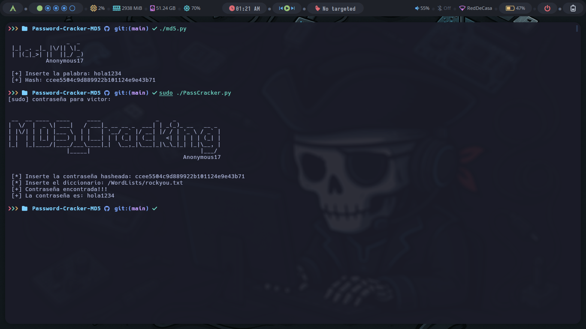

<h1 align="center">🔐 MD5 Hasher & Password Cracker 🔓</h1>

Ejemplo de Uso:
<p align="center">
  
</p>

## Descripción
Este proyecto contiene dos herramientas desarrolladas en Python:
- `md5.py`: Genera el hash MD5 de una palabra dada.
- `PassCracker.py`: Crackea una contraseña MD5 usando un diccionario.

## Requisitos
Asegúrate de tener Python 3.x instalado.

### Cómo clonar el repositorio

```sh
git clone https://github.com/anonymous-17-03/Password-Cracker-MD5.git
cd md5-tools
```

### Uso
Generar hash MD5

```sh
python md5.py
```

Crackear contraseña MD5

```sh
python PassCracker.py
```

## Contacto
¡Me encantaría saber de ti! Puedes contactarme a través de las siguientes plataformas:

- GitHub: [anonymous-17-03](https://github.com/anonymous-17-03)
- LinkedIn: [victor-garcía-nova-hacking](https://linkedin.com/in/victor-garcía-nova-hacking)
- Correo electrónico: [victordgarciap2003@gmail.com](mailto:victordgarciap2003@gmail.com)
